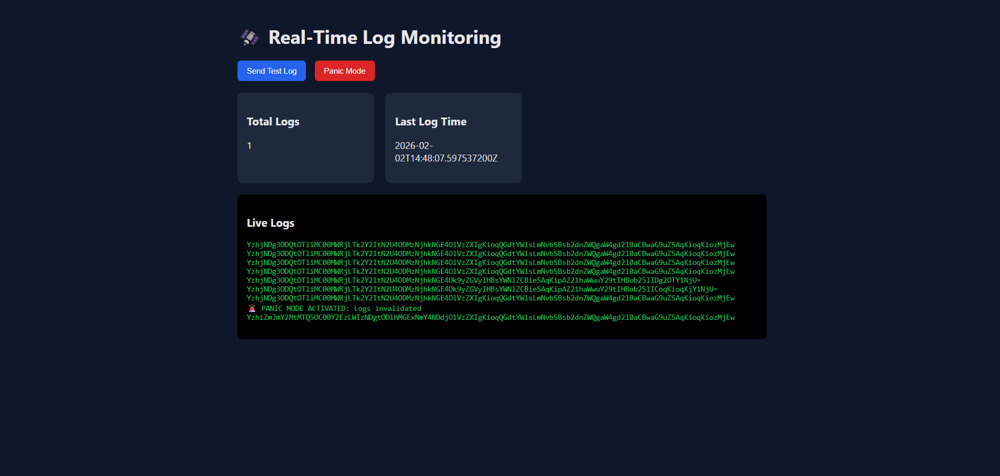

# 🔐 Real-Time Log Monitoring System

A **full-stack, real-time log ingestion and monitoring system** built with **Spring Boot**, **WebSockets**, and a lightweight **HTML/CSS/JavaScript** dashboard.

The system securely ingests logs, **masks sensitive data**, **encrypts logs in memory**, streams them live to a dashboard, and provides an emergency **panic mode** to instantly invalidate logs.

This project focuses on **real-world backend concepts** such as observability, security, real-time systems, and incident response.

---

## 🚀 Features

- 🔄 Real-time log ingestion via REST APIs  
- 🔐 Sensitive data masking (emails & phone numbers)  
- 🧠 In-memory encrypted log storage (sliding window – last 100 logs)  
- 📡 Live log streaming using WebSockets  
- 🚨 Panic mode with encryption key rotation & log invalidation  
- 📊 Metrics & observability (total logs, last log time)  
- 🖥️ Modern real-time monitoring dashboard  

---

## 🧩 Architecture Overview

### Components
1. **Log Producers** – Applications sending logs  
2. **Backend Ingestion Service** – Spring Boot  
3. **In-Memory Stores** – Logs & metrics  
4. **WebSocket Layer** – Live log streaming  
5. **Frontend Dashboard** – Real-time UI  

### Data Flow
1. Applications send logs via REST API  
2. Backend masks sensitive data  
3. Logs are encrypted in memory  
4. Logs stored in a sliding window (last 100 logs)  
5. WebSocket broadcasts logs to connected clients  
6. Metrics are updated in real time  
7. Panic mode clears logs and rotates encryption keys  

---

## 🏗️ Backend Design

- **Controller Layer** – REST endpoints  
- **Service Layer** – Core business logic  
- **Store Layer** – In-memory storage  
- **Security Layer** – Encryption & key rotation  
- **WebSocket Layer** – Live streaming  

---

## 🔌 API Endpoints

| Method | Endpoint | Description |
|------|--------|------------|
| POST | `/logs` | Send a log |
| GET | `/logs` | Fetch recent logs |
| GET | `/logs/metrics` | View metrics |
| POST | `/logs/panic` | Activate panic mode |
| GET | `/logs/health` | Health check |
| WS | `/ws/logs` | Live log stream |

---

## 🚨 Panic Mode (Why It Exists)

In real-world systems, logs may accidentally contain sensitive data.  
If a security breach or misconfiguration is detected, the system must invalidate logs **immediately**.

Panic mode:
- Rotates the encryption key  
- Clears all in-memory logs  
- Resets metrics  
- Broadcasts an emergency message to all connected clients  

This simulates **incident response behavior** used in production systems.

---

## 🧪 How to Verify the System

### Test 1: Send a Log
- Use UI **Send Test Log** or `POST /logs`  
- Email & phone numbers are masked  
- Encrypted log appears in dashboard  
- Metrics increment

### Test 2: Multiple Logs
- Send logs multiple times  
- Logs stream live via WebSocket  
- `totalLogs` increases correctly

### Test 3: Panic Mode
- Trigger `POST /logs/panic` or UI button  
- Logs are cleared  
- Metrics reset  
- Emergency message is broadcast

✅ If all tests pass → system is working correctly.

---

## 🖥️ Frontend Dashboard

### Features
- Send test logs  
- View live encrypted logs  
- Monitor total logs & last log time  
- Trigger panic mode instantly

### Screenshot


---

## ▶️ How to Run

### Backend
```bash
# Java 17+
./mvnw spring-boot:run
```

Backend runs on:
```
http://localhost:8081
```

### Frontend
```bash
Open frontend/index.html
# or use VS Code Live Server
```

---

## 🧰 Tech Stack

* **Backend**: Java 17, Spring Boot  
* **Real-Time**: WebSockets  
* **Frontend**: HTML, CSS, JavaScript  
* **Storage**: In-memory data structures  
* **Security**: Masking + encryption + key rotation

---

## ⚠️ Current Limitations

* Logs are stored in memory (no persistence)  
* No authentication or authorization  
* Single-node deployment

These trade-offs were intentional to focus on **real-time behavior, security concepts, and system design fundamentals**.

---

## 📅 Project Timeline

* ✅ Day 1: Project setup & planning  
* ✅ Day 2: REST-based log ingestion  
* ✅ Day 3: Service layer & encryption  
* ✅ Day 4: Email & phone masking  
* ✅ Day 5: In-memory sliding window storage  
* ✅ Day 6: WebSocket live streaming  
* ✅ Day 7: Panic mode & key rotation  
* ✅ Day 8: Metrics, health & observability  
* ✅ Day 9: Frontend dashboard & full-stack integration

---

## 📌 Why This Project Matters

* Demonstrates real-time systems  
* Shows security-first thinking  
* Covers backend + frontend integration  
* Mirrors production logging pipelines  
* Uses patterns seen in large-scale systems

---

## 👨‍💻 Author

Manjunath G K  
Backend / Software Engineering Enthusiast

🔗 LinkedIn: https://www.linkedin.com/in/manjunath-g-k  
🐙 GitHub: https://github.com/Manjunath-G-K

⭐ If you found this project useful, feel free to star the repository!
